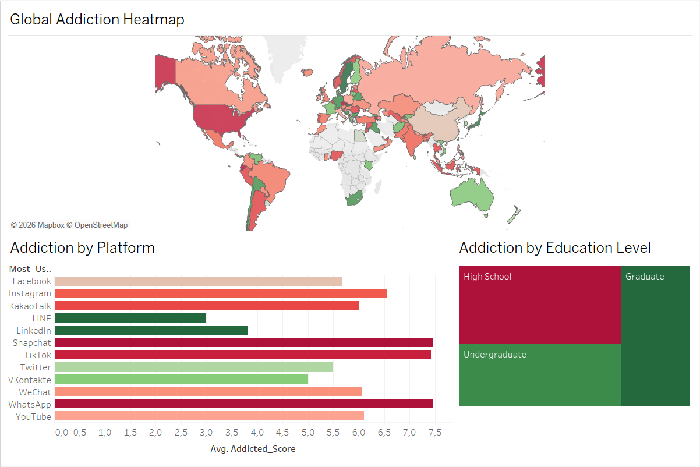

# 📱 Student Social Media Addiction Prediction & Analysis


Bu proje, öğrencilerin sosyal medya kullanım alışkanlıklarını, uyku düzenlerini ve ruh hallerini analiz eden **Uçtan Uca (End-to-End)** bir veri bilimi projesidir. Proje kapsamında hem **Yapay Zeka (AI)** ile bağımlılık tahmini yapılmakta hem de **Tableau** ile detaylı veri görselleştirme sunulmaktadır.

---

## 🚀 1. Canlı Uygulama (AI Prediction App)

Makine öğrenmesi modelini kullanarak bağımlılık seviyenizi ölçen web uygulamasını deneyin:

👉 **[Tıkla ve Test Et: Social Media Addiction Predictor](https://students-social-media-addiction-prediction.streamlit.app)**

> **⚠️ Not:** Uygulama uyku modundaysa açılması 20-30 saniye sürebilir, lütfen bekleyiniz.

---

## 📊 2. Tableau Dashboard (Veri Görselleştirme)

Veri setindeki trendleri, ülkeler arası dağılımı ve platform bazlı bağımlılık oranlarını incelemek için interaktif bir dashboard hazırlanmıştır.



**Dashboard'da Neler Var?**
* 🌍 **Global Heatmap:** Hangi ülkelerdeki öğrencilerin daha yüksek bağımlılık skoruna sahip olduğu.
* 📱 **Platform Analizi:** Instagram, TikTok vb. platformların ruh sağlığı üzerindeki etkisi.
* 🎓 **Eğitim Seviyesi Analizi (Tree Map):** Lise, Lisans ve Yüksek Lisans öğrencilerinin risk dağılımı.

📥 **Dosyayı İncele:**
Dashboard'u kendi bilgisayarınızda açmak için `.twbx` dosyasını indirebilirsiniz:
👉 **[Social_Media_Analysis.twbx İndir](Social_Media_Analysis.twbx)**

---

## 🧐 Proje Detayları

**Kullanılan Teknolojiler:**
* **Python & Pandas:** Veri temizleme ve ön işleme.
* **Scikit-Learn & XGBoost:** Makine öğrenmesi modeli eğitimi.
* **Streamlit:** Modelin web uygulamasına dönüştürülmesi (Deployment).
* **Tableau:** İş Zekası (BI) raporlaması ve görselleştirme.

**Model Performansı:**
Model, öğrencinin ruh hali, uyku saati ve sosyal medya kullanım süresine bakarak **2 ile 9 arasında** bir risk skoru üretir.
* **Skor 7+:** Yüksek Risk (Kritik Seviye)
* **Skor 5-7:** Orta Risk
* **Skor <5:** Düşük Risk

---

## 🛠️ Kurulum (Local Çalıştırma)

Projeyi kendi bilgisayarınızda çalıştırmak için:

```bash
# 1. Repoyu Klonlayın
git clone [https://github.com/TunahanKicci/Students-Social-Media-Addiction-prediction.git](https://github.com/TunahanKicci/Students-Social-Media-Addiction-prediction.git)
cd Students-Social-Media-Addiction-prediction

# 2. Kütüphaneleri Yükleyin
pip install -r requirements.txt

# 3. Uygulamayı Başlatın
streamlit run app.py

```

---

## 📂 Dosya Yapısı

```
├── app.py                            # Streamlit Web Uygulaması
├── social_media_addiction_model.pkl  # Eğitilmiş AI Modeli
├── Social_Media_Analysis.twbx        # Tableau Dashboard Dosyası
├── tableau_dashboard.png             # Dashboard Ekran Görüntüsü
├── requirements.txt                  # Python Kütüphaneleri
└── README.md                         # Proje Dokümantasyonu

```

---

## 👨‍💻 Geliştirici

**Tunahan Kıççı**

* 💼 **LinkedIn:** [Tunahan Kıççı](https://www.google.com/search?q=https://www.linkedin.com/in/tunahan-kicci)
* 🐙 **GitHub:** [@TunahanKicci](https://www.google.com/search?q=https://github.com/TunahanKicci)

⭐ *Bu projeyi beğendiyseniz sağ üstten "Star" vermeyi unutmayın!*

